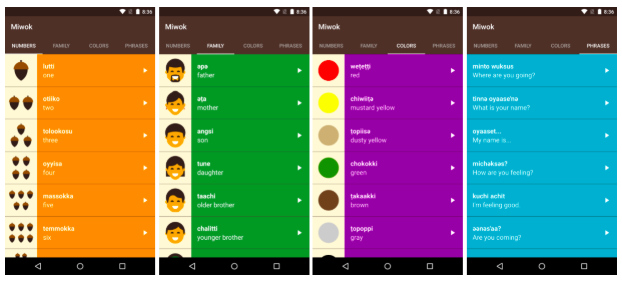

Miwok App
===================================

This app displays lists of vocabulary words for the user to learn the Miwok language.
Used in a Udacity course in the Beginning Android Nanodegree.

Great way to learn how to navigate through multiple Activity views, as well as introducing me to
the concepts of adapters, fragments, and Java class inheritance.

Pre-requisites
--------------

- Android SDK v23
- Android Build Tools v23.0.2
- Android Support Repository v23.3.0

Getting Started
---------------

This sample uses the Gradle build system. To build this project, use the
"gradlew build" command or use "Import Project" in Android Studio.

